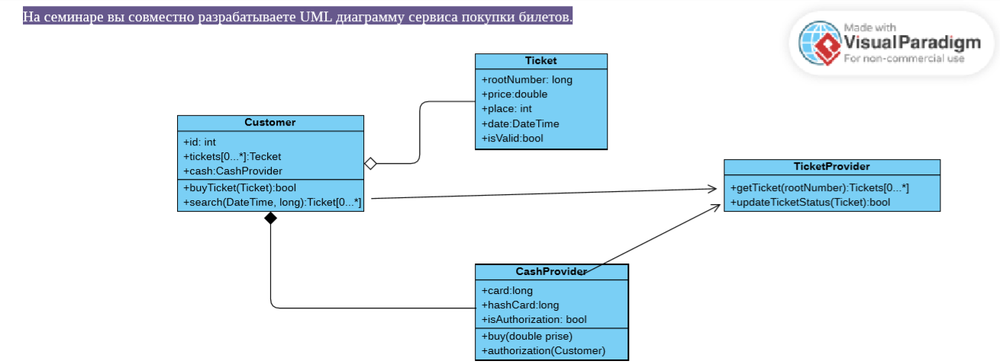
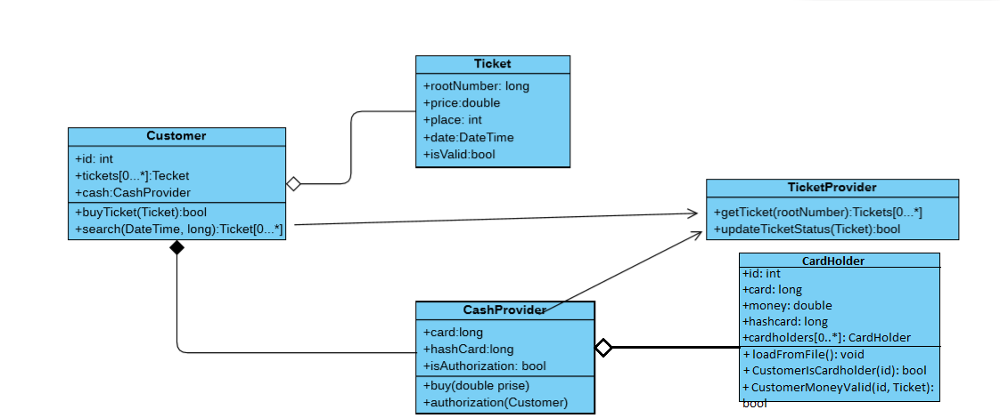

> **СЕМИНАР 4. Компоненты. Принципы связности и сочетаемости компонентов**

> Домашнее задание: По UML диаграмме написать сервис по продаже билетов,и её применить(метро,автобус,театр,самолёт и т.д.) так же прикрепить обновлённую диаграмму

> Выполнение :
* Создал классы и заполнил согласно диаграмме
* Прописал взаимодействие классов (возврат boolean значений в TicketProvider, поиск билетов, условия для покупки билетов)
* Принял решение добавить класс CardHolder, который будет отвечать за бэк нашей "банковской системы".
* В классе CardHolder создал методы для ситывания и записи файла, содержащего условную БД с данными клиентов,  а также методы для проверки наличия пользователя в системе и проверки наличия денежных средств.
* Понятно, что данный класс лучше разделить еще на два класса, но, в целях экономии времени, я оставил всё в одном. (так же очевидно, что можно апгрейдить программу до бесконечности, поэтому такие методы, как хэширование данных карты и уникальные ИД пользователя я опустил).
* После добавления CardHolder диаграмма стала выглядеть так:

**И, наконец, примеры тестирования программмы:**

* ТЕСТ1: Пользователь, который есть в системе, с наличием необходимого количества денежных средств на счете, покупает билет стоимомтью 400:

* ТЕСТ2: Пользователь, который есть в системе, но у которого нет денежных средств на счете, покупает билет стоимомтью 400:

* ТЕСТ3: Пользователь, которого "нет в системе":

